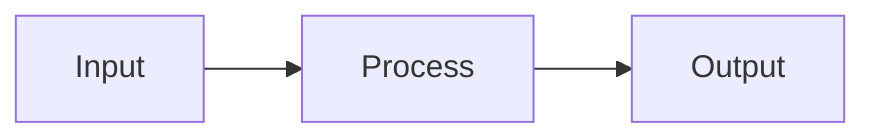

# Enrich Content

Add supporting material to existing blog posts or annotated readings.

**IMPORTANT:** This skill is strictly opt-in. You may suggest enrichments ("this post could benefit from a diagram of X") but NEVER act without explicit user consent. Wait for the user to say yes before making any changes.

## Inputs

- **Target**: Which post or annotation to enrich
- **What to add**: Specific user request (diagram, references, data, research)

## Enrichment Types

### Diagrams

Use Mermaid code blocks for diagrams:



Mermaid supports: flowcharts, sequence diagrams, state diagrams, gantt charts. Keep diagrams simple — they should clarify, not overwhelm.

### References and links

Use WebSearch to find relevant supporting material:

- Academic papers or authoritative sources
- Related blog posts or articles
- Official documentation

Add references inline as markdown links, or as a "Further Reading" section at the end.

### Data and research

Use WebSearch to find statistics, benchmarks, or research that supports the post's claims. Cite sources with links. Be precise about numbers — don't round or approximate without noting it.

### Images

If the user wants images, note that images should be placed in `public/` and referenced with absolute paths. Suggest the user provide or generate images separately — do not generate image URLs.

## Process

1. Read the target content
2. Understand the user's specific enrichment request
3. Research as needed (WebSearch, WebFetch)
4. Present proposed additions to the user for approval before editing
5. Make the edits
6. Commit:

   ```bash
   git add {changed files}
   git commit -m 'content(enrich): add {what} to "{title}"

   {brief description of what was added}

   Co-Authored-By: Claude <noreply@anthropic.com>'
   ```

## Guidelines

- Additions should match the voice and style of the existing content
- Don't over-enrich — a few well-placed additions are better than many
- Always cite sources for factual claims
- Diagrams should be simple and focused
- Never modify the core argument or narrative without explicit consent
