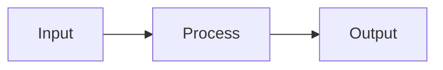

# Content Management Skills — Implementation Plan

> **For Claude:** REQUIRED SUB-SKILL: Use superpowers:executing-plans to implement this plan task-by-task.

**Goal:** Create five Claude Code skills for managing blog posts and annotated readings, with structured git commits for provenance.

**Architecture:** Each skill is a standalone markdown file in `.claude/skills/` that teaches Claude a content workflow. Skills reference exact file paths, frontmatter formats, and commit conventions. No new code — just instructional documents that leverage existing tools.

**Tech Stack:** Claude Code skills (markdown), existing Astro content collections, existing article fetcher script.

---

### Task 1: Create skills directory and `write-blog-post` skill

**Files:**

- Create: `.claude/skills/write-blog-post.md`

**Step 1: Create the skills directory**

```bash
mkdir -p .claude/skills
```

**Step 2: Write the skill file**

Create `.claude/skills/write-blog-post.md` with the following content:

````markdown
---
name: write-blog-post
description: Create a new blog post as a draft. Use when asked to write, draft, or create a blog post.
---

# Write Blog Post

Create a new blog post in this Astro website.

## Inputs

- **Topic/title**: What the post is about (from user prompt or ask)
- **Tags**: Relevant tags (infer from topic, confirm with user)

## Process

### 1. Determine title and slug

Ask the user for a topic if not provided. Generate a slug:

- Lowercase the title
- Strip apostrophes and smart quotes (keep contractions together)
- Replace non-alphanumeric characters with hyphens
- Remove leading/trailing hyphens

Example: "I Asked Claude Code to Investigate" → `i-asked-claude-code-to-investigate`

### 2. Create the file

Create `src/content/blog/{slug}.md` with this frontmatter:

```yaml
---
title: "{title}"
description: "{1-2 sentence description}"
date: { YYYY-MM-DD }
tags: [{ comma-separated tags }]
draft: true
---
```

**Frontmatter rules:**

- `title`: Sentence case, in quotes
- `description`: Brief summary, in quotes
- `date`: Today's date in YYYY-MM-DD format
- `tags`: Array of lowercase kebab-case strings. Check existing tags first: `grep -r "tags:" src/content/blog/ | sort -u` to stay consistent
- `draft`: Always `true` for new posts — publish later via `manage-drafts` skill

### 3. Write the content

Write the full post in markdown below the frontmatter. Follow these conventions:

- Use `##` for major sections (h2), `###` for subsections (h3)
- Use fenced code blocks with language tags for code
- Keep paragraphs focused — one idea per paragraph
- No trailing whitespace, single blank line between sections
- Do not add a `# Title` heading — the layout adds it from frontmatter

### 4. Commit

```bash
git add src/content/blog/{slug}.md
git commit -m 'content(blog): create draft "{title}"

Co-Authored-By: Claude <noreply@anthropic.com>'
```

Stage only the new file. Never use `git add -A`. Never push.
````

**Step 3: Verify the file exists and is valid markdown**

```bash
cat .claude/skills/write-blog-post.md | head -5
```

Expected: The YAML frontmatter header with `name: write-blog-post`.

**Step 4: Commit**

```bash
git add .claude/skills/write-blog-post.md
git commit -m "feat(skills): add write-blog-post skill"
```

---

### Task 2: Create `create-annotated-reading` skill

**Files:**

- Create: `.claude/skills/create-annotated-reading.md`

**Step 1: Write the skill file**

Create `.claude/skills/create-annotated-reading.md`:

````markdown
---
name: create-annotated-reading
description: Fetch an article by URL and create an annotated reading with highlights and notes. Use when asked to annotate an article or create an annotated reading.
---

# Create Annotated Reading

Fetch an external article and create an annotated reading with margin and inline notes.

## Inputs

- **URL**: The article URL to annotate (required)
- **Focus areas**: What to pay attention to when annotating (optional — ask if not provided)

## Process

### 1. Fetch the article

Run the article fetcher script:

```bash
npx tsx scripts/fetch-article.ts "<url>"
```

This outputs JSON: `{ title, author, content, slug, sourceUrl }`

If the script fails (Playwright not installed, URL unreachable, etc.), tell the user and suggest:

```bash
npx playwright install chromium
```

### 2. Create the source file

Create `src/content/annotations/{slug}/source.md`:

```yaml
---
title: "{title}"
author: "{author}"
sourceUrl: "{url}"
snapshotDate: { YYYY-MM-DD }
description: "{1-2 sentence description of why this article is worth reading}"
tags: [{ relevant tags }]
draft: true
---
{ article content in markdown, as returned by the fetcher }
```

**Notes:**

- If the fetcher returned an empty author, ask the user or leave as empty string
- `snapshotDate` is today's date (when the article was fetched)
- `description` should be written from the user's perspective ("My annotated reading of...")
- `draft: true` always — publish later via `manage-drafts` skill

### 3. Read the article and identify passages to annotate

Read the full source text carefully. Look for:

- Key claims or arguments worth highlighting
- Surprising or counterintuitive statements
- Practical advice or actionable insights
- Passages that connect to other ideas
- Memorable phrases or framings

### 4. Write annotations

Create `src/content/annotations/{slug}/annotations.yaml`:

```yaml
annotations:
  - id: "a1"
    anchor: "exact text from the article"
    startContext: "preceding 20-30 chars"
    type: "margin"
    note: "Short observation or connection."

  - id: "a2"
    anchor: "another exact passage"
    startContext: "preceding text for disambiguation"
    type: "inline"
    note: "Longer commentary with analysis, personal experience, or connections to other ideas."
```

**Annotation rules:**

- `id`: Sequential `a1`, `a2`, `a3`, etc.
- `anchor`: Must be an EXACT substring of the source text. Copy-paste, don't rephrase. Keep to a phrase or sentence — not full paragraphs.
- `startContext`: The ~20-30 characters immediately before the anchor text in the source. Always include this for disambiguation. Omit only if the anchor is at the very start of the article.
- `type`:
  - `"margin"` — Short notes (1-2 sentences). Shown in the right margin on desktop, popover on mobile.
  - `"inline"` — Longer commentary (2+ sentences). Shown as an expandable block below the highlight.
- `note`: Markdown supported. Can include links, emphasis, code. Write from the reader's perspective — personal reactions, connections, critiques.

**Quality guidelines:**

- Aim for 5-15 annotations per article (depends on length)
- Mix of margin and inline — margin for quick reactions, inline for deeper analysis
- Don't annotate every paragraph — be selective
- Notes should add value beyond what the text already says

### 5. Verify anchors match

Read back the source text and confirm every `anchor` string appears exactly in the text. If any anchor doesn't match, fix it before committing.

### 6. Commit

```bash
git add "src/content/annotations/{slug}/source.md" "src/content/annotations/{slug}/annotations.yaml"
git commit -m 'content(annotations): create draft "{title}" with N annotations

Co-Authored-By: Claude <noreply@anthropic.com>'
```

Replace `N` with the actual annotation count. Stage only the two files. Never push.
````

**Step 2: Verify**

```bash
cat .claude/skills/create-annotated-reading.md | head -5
```

**Step 3: Commit**

```bash
git add .claude/skills/create-annotated-reading.md
git commit -m "feat(skills): add create-annotated-reading skill"
```

---

### Task 3: Create `manage-drafts` skill

**Files:**

- Create: `.claude/skills/manage-drafts.md`

**Step 1: Write the skill file**

Create `.claude/skills/manage-drafts.md`:

````markdown
---
name: manage-drafts
description: List, publish, or unpublish blog posts and annotated readings. Use when asked to publish, unpublish, list drafts, or manage draft state.
---

# Manage Drafts

List, publish, or unpublish content (blog posts and annotated readings).

## Commands

### List drafts

Find all content with `draft: true`:

1. Search blog posts:

   ```bash
   grep -l "draft: true" src/content/blog/*.md
   ```

2. Search annotations:

   ```bash
   grep -rl "draft: true" src/content/annotations/*/source.md
   ```

3. For each match, read the frontmatter and display:
   - Type (blog / annotation)
   - Title
   - Date
   - File path

### Publish

Set `draft: false` (or remove the `draft` line) in the target file's frontmatter.

1. Find the file:
   - Blog: `src/content/blog/{slug}.md`
   - Annotation: `src/content/annotations/{slug}/source.md`
2. Edit the frontmatter: change `draft: true` to `draft: false`
3. Commit:

   ```bash
   git add {file}
   git commit -m 'content({scope}): publish "{title}"

   Co-Authored-By: Claude <noreply@anthropic.com>'
   ```

### Unpublish

Set `draft: true` in the target file's frontmatter.

1. Find the file (same as publish)
2. Edit the frontmatter: change `draft: false` to `draft: true`
3. Commit:

   ```bash
   git add {file}
   git commit -m 'content({scope}): unpublish "{title}"

   Co-Authored-By: Claude <noreply@anthropic.com>'
   ```

**Scope** is `blog` or `annotations` depending on the content type.

## Notes

- Always confirm with the user before publishing (going live on the website)
- Unpublishing removes the page from the production site on next deploy
- In dev mode (`npm run dev`), drafts are still visible with a "Draft" badge
````

**Step 2: Verify and commit**

```bash
cat .claude/skills/manage-drafts.md | head -5
git add .claude/skills/manage-drafts.md
git commit -m "feat(skills): add manage-drafts skill"
```

---

### Task 4: Create `review-content` skill

**Files:**

- Create: `.claude/skills/review-content.md`

**Step 1: Write the skill file**

Create `.claude/skills/review-content.md`:

````markdown
---
name: review-content
description: Review and spell-check blog posts or annotated readings. Use when asked to proofread, review, spell-check, or fix content.
---

# Review Content

Proofread and review blog posts or annotated readings for quality issues.

## Inputs

- **Target**: Which post or annotation to review (title, slug, or "all drafts")

## Process

### 1. Find and read the content

- Blog: `src/content/blog/{slug}.md`
- Annotation source: `src/content/annotations/{slug}/source.md`
- Annotation notes: `src/content/annotations/{slug}/annotations.yaml`

If the user says "all drafts", list drafts first (see `manage-drafts` skill), then review each.

### 2. Check for issues

**Frontmatter:**

- All required fields present (title, description, date, tags for blog; title, author, sourceUrl, snapshotDate, description, tags for annotations)
- Date format is YYYY-MM-DD
- Tags are lowercase kebab-case
- Description is present and meaningful (not placeholder text)

**Content (blog posts):**

- Spelling and grammar errors
- Broken markdown syntax (unclosed code blocks, malformed links)
- Inconsistent heading levels (should start at h2, not h1)
- Broken links (use WebFetch to verify external URLs if there are only a few; skip if many)
- Missing alt text on images
- Overly long paragraphs (suggest breaking up if > 5 sentences)

**Content (annotations):**

- All `anchor` strings actually appear in the source text
- `startContext` is present for disambiguation
- `id` values are unique and sequential
- `type` is either "margin" or "inline"
- Notes are substantive (not just "interesting" or "good point")
- Markdown in notes renders correctly

### 3. Present findings

List all issues found, grouped by severity:

- **Errors**: Broken anchors, missing required fields, invalid markdown
- **Warnings**: Missing startContext, missing description, broken links
- **Suggestions**: Typos, grammar, style improvements

Ask the user which fixes to apply.

### 4. Apply fixes

Edit files to fix approved issues. Do not change the substance or voice of the writing — only fix mechanical issues unless asked.

### 5. Commit

```bash
git add {changed files}
git commit -m 'content(review): fix issues in "{title}"

{brief summary of what was fixed}

Co-Authored-By: Claude <noreply@anthropic.com>'
```
````

**Step 2: Verify and commit**

```bash
cat .claude/skills/review-content.md | head -5
git add .claude/skills/review-content.md
git commit -m "feat(skills): add review-content skill"
```

---

### Task 5: Create `enrich-content` skill

**Files:**

- Create: `.claude/skills/enrich-content.md`

**Step 1: Write the skill file**

Create `.claude/skills/enrich-content.md`:

`````markdown
---
name: enrich-content
description: Add diagrams, references, research, or data to existing content. Use ONLY when explicitly asked to enrich, add diagrams, add references, or add research to a post.
---

# Enrich Content

Add supporting material to existing blog posts or annotated readings.

**IMPORTANT:** This skill is strictly opt-in. You may suggest enrichments ("this post could benefit from a diagram of X") but NEVER act without explicit user consent. Wait for the user to say yes before making any changes.

## Inputs

- **Target**: Which post or annotation to enrich
- **What to add**: Specific user request (diagram, references, data, research)

## Enrichment Types

### Diagrams

Use Mermaid code blocks for diagrams:

````markdown

````

Mermaid supports: flowcharts, sequence diagrams, state diagrams, gantt charts. Keep diagrams simple — they should clarify, not overwhelm.

### References and links

Use WebSearch to find relevant supporting material:

- Academic papers or authoritative sources
- Related blog posts or articles
- Official documentation

Add references inline as markdown links, or as a "Further Reading" section at the end.

### Data and research

Use WebSearch to find statistics, benchmarks, or research that supports the post's claims. Cite sources with links. Be precise about numbers — don't round or approximate without noting it.

### Images

If the user wants images, note that images should be placed in `public/` and referenced with absolute paths. Suggest the user provide or generate images separately — do not generate image URLs.

## Process

1. Read the target content
2. Understand the user's specific enrichment request
3. Research as needed (WebSearch, WebFetch)
4. Present proposed additions to the user for approval before editing
5. Make the edits
6. Commit:

   ```bash
   git add {changed files}
   git commit -m 'content(enrich): add {what} to "{title}"

   {brief description of what was added}

   Co-Authored-By: Claude <noreply@anthropic.com>'
   ```

## Guidelines

- Additions should match the voice and style of the existing content
- Don't over-enrich — a few well-placed additions are better than many
- Always cite sources for factual claims
- Diagrams should be simple and focused
- Never modify the core argument or narrative without explicit consent
`````

**Step 2: Verify and commit**

```bash
cat .claude/skills/enrich-content.md | head -5
git add .claude/skills/enrich-content.md
git commit -m "feat(skills): add enrich-content skill"
```

---

### Task 6: Verify all skills are discoverable

**Step 1: List all skill files**

```bash
ls -la .claude/skills/
```

Expected: 5 files:

- `write-blog-post.md`
- `create-annotated-reading.md`
- `manage-drafts.md`
- `review-content.md`
- `enrich-content.md`

**Step 2: Verify each skill has valid frontmatter**

```bash
head -4 .claude/skills/*.md
```

Each should have `---`, `name:`, `description:`, `---`.

**Step 3: Test one skill invocation**

Run the `manage-drafts` skill to list drafts — this is the simplest and most verifiable:

```bash
grep -l "draft: true" src/content/blog/*.md 2>/dev/null; grep -rl "draft: true" src/content/annotations/*/source.md 2>/dev/null
```

Verify the output matches expected drafts in the repo.

**Step 4: Final commit with all skills**

If any skills were not individually committed, do a final commit:

```bash
git status
```

If clean, no action needed. If uncommitted files remain, commit them.
